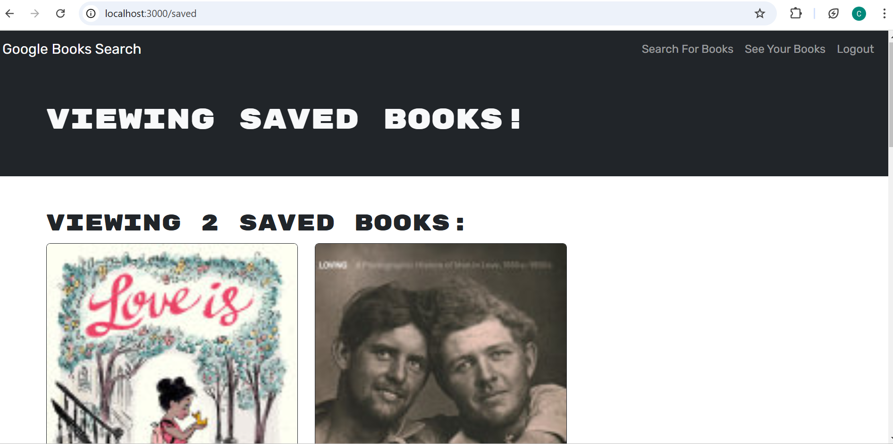

# Book Search Engine

## Table of Contents
- [Description](#description)
- [Installation](#installation)
- [Usage](#usage)
- [Licenses](#licenses)
- [Contributors](#contributors)
- [Testing](#testing)
- [Contact](#contact-info-for-questions)
- [Screenshots](#screenshots)
- [Link](#application-link)

## Description
This application is a demonstration of my skills using apollo server GraphQl and authorization login. Users can search for books, save books to their profiles, and delete books.

## Installation
n/a

## Usage
To use this application, sign up or log in, view and search different books, save wnated books to your profile, and delete them.

## Licenses
#### MIT License
The MIT License is an older license used to provide copyright protection.

## Contributors
Christine Matthews

## Testing
n/a

## Contact info for Questions
#### Github: 
<a href="https://github.com/cmatthews3212">cmatthews3212</a>

#### Email: 
<a href="mailto: matthews.christinemarie@gmail.com">matthews.christinemarie@gmail.com</a>

## Screenshots

## Application Link
https://book-search-3a0m.onrender.com/
